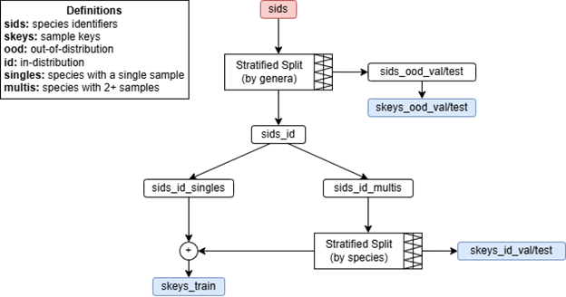

# Metadata Generation

Note: everything described in this file is executed when `./setup.sh` is run from the root as described in the setup procedure.

## Species ID Generation

**metadata/gen_species_ids.py**

To execute from root:
```
python -m metadata.gen_species_ids
```

**Requires:**
- Butterflies data on HiPerGator

**Produces:**
- `metadata/species_ids/all.pkl`
- `metadata/species_ids/known.pkl`
- `metadata/species_ids/unknown.pkl`


## Generate Taxonomic structure
**metadata/gen_tax_nymph.py**

To execute from root:
```
python -m metadata.gen_tax_nymph
```
**Requires:**
- `metadata/species_ids/known.pkl`

**Produces:**
- `metadata/tax/nymph.pkl`


## Generate Data Split
**metadata/gen_split.py**

To execute from root:
```
python -m metadata.gen_split
```
**Requires:**
- `metadata/tax/nymph.pkl`

**Produces:**
- `metadata/splits/<split_name>/*`

This is configured to generate split S29-42 by default, but can be adjusted in `config/gen_split.yaml`.

Conventions used for split naming, using S29-42 as an example:
* **29** refers to 29% of the data being split out (equally distributed between ID/OOD eval/test)
* **42** refers to the seed used for split generation

This script generates in-distribution (ID) and out-of-distribution (OOD) stratified splits for train/validation/test.

First, entire species are split out for OOD zero-shot evaluation. Selection is stratified by genus and tuned to hit a target OOD proportion by number of species and total samples within a specified tolerance. Next, ID eval splits are sampled from the remaining pool. Singleton classes are temporarily excluded so they don't leak pseudo-OOD examples into ID eval (selection of such samples for ID eval would effectively render them OOD). Samples corresponding to non-singleton species are split into ID val/test sets, stratified by species. The remainder of the samples are joined with the singletons to produce the train set.



The sklearn stratified splitter (train_test_split) errors out if the number of classes exceeds the number of test samples, which was the case for the OOD splits. Also, in the ID case, because our dataset is extremely long-tailed, with many classes that have very few instances, the sklearn stratified split yields a significant number of species that are completely unsampled from. To address these problems, each stratified split is performed in 2 stages:
* Sparse Stratified Split (custom sampling method)
* Standard Stratified Split (sklearn)

For the OOD splits, classes are genera and instances are species. For the ID splits, classes are species and instances are samples. Stratification process: Overall, the classes are first grouped by their instance-counts (1-instance classes, 2-instance classes, etc.). The sparse stratified splitter algorithm then samples from the classes with the fewest amount of instances in a way that abides by the target split percentage. For example, if the target OOD split percentage is 10%, the sparse splitter will first iterate through classes containing 1 instance and select 1 class for val/test from every ten 1-instance classes. It will then iterate through 2-instance classes and select 1 instance for val/test from every five 2-instance classes. This pattern continues until n (for n-instances) becomes high enough that the sklearn splitter behaves as desired, at which point the sklearn stratified splitter is used for the remainder of the larger classes.
Note: The ID split begins at 2-instance classes (2-sample species) because the singletons are first removed for reasons previously described.
Note: The first stage of stratification (sparse) is done to ensure a well-distributed split among classes with fewer instances. By default, the sklearn stratified splitter (and all the other numerous stratified splitters I tried) will leave these unassigned, effectively leaving the tail end of the distribution completely unsampled from. In other words, the standard sklearn splitting process biases evaluation away from measuring few-shot learning.

Datastructures are created for tracking n-shot subsets of ID splits for monitoring robustness to class imbalance and the assessing the effectiveness of class imbalance methods utilized. Stats regarding the variety (num. species) and volume (num. samples) of n-shot ID eval subsets are produced to get an idea of the statistical significance of the different n-shot subsets (subsets with lower volume are less significant) and are used to adjust the bounds of the n-shot buckets such that they are more statistically significant.

## Generate Rank Keys
**metadata/gen_rank_keys.py**

To execute from root:
```
python -m metadata.gen_rank_keys
```
**Requires:**
- `metadata/tax/nymph.pkl`

**Produces:**
- `metadata/rank_keys/nymph.pkl`

Rank keys are used for generating intermediate targets for use with hierarchical loss. Future work involves experimentation with phylogenetic distance metrics to provide a higher fidelity learning signal.


# Lepidoptera CSV's

The CSV file at `paths["lepid_metadata_imgs"]` is formatted as follows:

```
                                image_name  \
0  db28f0d0-5b757e38-d8383c8f-214d7dac.jpg   
1  fef02eec-650f3939-0a7df3db-dc40c8c6.jpg   
2  761f5e99-b1bab97a-ad42e424-def79486.jpg   
3  64f57dee-b9bf653f-9a0af68d-5852e94f.jpg   
4  12cac220-72249379-0c166cce-e81ae08a.jpg   

                                   mask_name  \
0  db28f0d0-5b757e38-d8383c8f-214d7dac_1.png   
1  fef02eec-650f3939-0a7df3db-dc40c8c6_1.png   
2  761f5e99-b1bab97a-ad42e424-def79486_1.png   
3  64f57dee-b9bf653f-9a0af68d-5852e94f_1.png   
4  12cac220-72249379-0c166cce-e81ae08a_1.png   

                                           mask_path      uuid  \
0  /data/mlurig/projects/2025_butterflies/data_ra...  36779957   
1  /data/mlurig/projects/2025_butterflies/data_ra...  36779940   
2  /data/mlurig/projects/2025_butterflies/data_ra...  36779940   
3  /data/mlurig/projects/2025_butterflies/data_ra...  36779960   
4  /data/mlurig/projects/2025_butterflies/data_ra...  36779944   

                                                 uri license     area  \
0  https://api.idigbio.org/v2/media/db28f0d05b757...     NaN  2026519   
1  https://api.idigbio.org/v2/media/fef02eec650f3...     NaN  1038387   
2  https://api.idigbio.org/v2/media/761f5e99b1bab...     NaN  1178469   
3  https://api.idigbio.org/v2/media/64f57deeb9bf6...     NaN  1206600   
4  https://api.idigbio.org/v2/media/12cac22072249...     NaN  1906237   

   diameter  width  height  confidence_seg class_dv  confidence_dv class_junk  \
0      2546   2522    1406        0.952629  ventral       0.999912  butterfly   
1      1800   1786    1040        0.966600  ventral       0.875199  butterfly   
2      1924   1909    1094        0.967092   dorsal       0.999920  butterfly   
3      1954   1921    1073        0.965890  ventral       0.727010  butterfly   
4      2429   2368    1392        0.957457  ventral       0.998985  butterfly   

   confidence_junk tax_rank tax_status     family                  species  \
0         0.742786      NaN        NaN  hedylidae       macrosoma_cascaria   
1         0.989308      NaN        NaN  hedylidae        macrosoma_coscoja   
2         0.994237      NaN        NaN  hedylidae        macrosoma_coscoja   
3         0.546808      NaN        NaN  hedylidae  macrosoma_leucophasiata   
4         0.992411      NaN        NaN  hedylidae     macrosoma_muscerdata   

   sex position life_stage  lat  lon source_db  
0  NaN      NaN        NaN  NaN  NaN  scanbugs  
1  NaN      NaN        NaN  NaN  NaN  scanbugs  
2  NaN      NaN        NaN  NaN  NaN  scanbugs  
3  NaN      NaN        NaN  NaN  NaN  scanbugs  
4  NaN      NaN        NaN  NaN  NaN  scanbugs
```

The CSV file at `paths["lepid_metadata_tax"]` is formatted as follows:

```
                                           tip_label      family  \
0  BN003919_CB11L091_Lycaenidae_Polyommatinae_Pol...  lycaenidae   
1  SRR921636_X_Lycaenidae_Polyommatinae_Polyommat...  lycaenidae   
2  BN003989_AD00P083_Lycaenidae_Polyommatinae_Pol...  lycaenidae   
3  BN003997_NK00P664_Lycaenidae_Polyommatinae_Pol...  lycaenidae   
4  BN005523_16A327_Lycaenidae_Polyommatinae_Polyo...  lycaenidae   

       subfamily         tribe        genus specific_epithet  \
0  polyommatinae  polyommatini     lysandra          coridon   
1  polyommatinae  polyommatini  polyommatus           icarus   
2  polyommatinae  polyommatini  neolysandra            diana   
3  polyommatinae  polyommatini    eumedonia          eumedon   
4  polyommatinae  polyommatini       maurus          vogelii   

              species suffix  
0    lysandra_coridon    NaN  
1  polyommatus_icarus    NaN  
2   neolysandra_diana    NaN  
3   eumedonia_eumedon    NaN  
4      maurus_vogelii    NaN
```

The CSV file at `paths["group"] / "data/datasets/butterflies_whole_specimen-clean_rot_512-v2025_05_07/metadata/data_tree_renamed_full.csv"` is formatted as follows:

```
                                          tip_labels             species  \
0  BN007033_EB19X001_Pieridae_Coliadinae_X_Abaeis...      abaeis_nicippe   
1  BN000074_BNSZS00388_Hesperiidae_Tagiadinae_Tag...          abantis_ja   
2  BN006067_KA18030ABRI_Hesperiidae_Tagiadinae_Ta...   abantis_tettensis   
3  SRR10158560_X_Riodinidae_Nemeobiinae_Nemeobiin...  abisara_bifasciata   
4  BN006857_FH18Z005_Riodinidae_Nemeobiinae_Nemeo...      abisara_burnii   

     genus  
0   abaeis  
1  abantis  
2  abantis  
3  abisara  
4  abisara
```